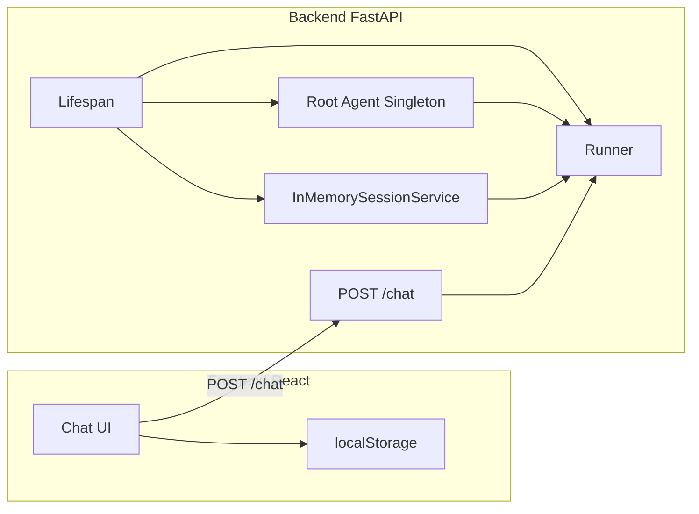

# Queens Connect Web Chat MVP

## Current state

- **Agent entry**: [queens_connect/main.py](queens_connect/main.py) exposes `run(wa_number, message, session_state, language_pref)` (sync) and `_run_async(...)` (async). Each call today builds a new `InMemorySessionService`, creates a session, calls `get_root_agent()`, builds a new `Runner`, then runs the message.
- **Expensive parts**: `get_root_agent()` (gatekeeper + prompts + sub-agents) and the first-time Firebase/tool setup. These should happen once at server startup, not per request.
- **Import path**: Backend will live at repo root under `backend/`. [run_orchestrator.py](queens_connect/run_orchestrator.py) shows the pattern: add repo root to `sys.path` so `queens_connect` is importable (repo root = parent of `backend/`).

## Architecture

**Persistence in one paragraph:** The FastAPI app uses an `on_startup` lifespan (or `@app.on_event("startup")`) to load `get_root_agent()` once and store it in a module-level or state variable. A single long-lived `InMemorySessionService` and one `Runner(agent=root_agent, session_service=session_service)` are also created at startup. On each `POST /chat`, the handler creates or reuses a session for the given `wa_number` (session*id = `wa*{wa_number}`): if the session does not exist, it creates it with `get_user`/`get_user_session`and initial state; then it calls`runner.run_async(...)` with the new message. The same agent and runner instance serve all requests; only per-user session state is created/updated. No cold start per request.

---

## 1. Backend (Python / FastAPI)

**Location:** New folder `backend/` at repo root (sibling to `queens_connect/`).

### 1.1 `backend/agent_runner.py`

- **Purpose:** Singleton-style runner and session service; used by FastAPI lifespan and by the `/chat` handler.
- **Startup (called once from lifespan):**
  - Prepend repo root to `sys.path`: `Path(__file__).resolve().parent.parent`.
  - Load env from repo root or `queens_connect/.env` (same as [queens_connect/config](queens_connect/config.py)).
  - `root_agent = get_root_agent()` (from `queens_connect.agent`).
  - `session_service = InMemorySessionService()`.
  - `runner = Runner(agent=root_agent, app_name="queens_connect", session_service=session_service)`.
  - Store these in a small state object or module-level variables (e.g. `_runner`, `_session_service`, `_root_agent`) for use in the API.
- **Per-request (async function called from FastAPI):**
  - `ensure_session(wa_number, language_pref)` (or inline): if session for `wa_{wa_number}` does not exist, call `get_user(wa_number)`, `get_user_session(wa_number)` (from `queens_connect.tools`), build `initial_state` as in [main.py lines 41–53](queens_connect/main.py), then `await session_service.create_session(...)`.
  - Build `types.Content(role="user", parts=[types.Part(text=message)])`.
  - `async for event in runner.run_async(user_id=wa_number, session_id=f"wa_{wa_number}", new_message=content):` and collect final response text (same logic as [main.py lines 65–69](queens_connect/main.py)).
  - Return reply string; on exception return a friendly fallback (e.g. "Eish, the network is playing up neh, try again in 2 minutes my bra.").

**Session reuse:** Use ADK’s `InMemorySessionService` as the single in-memory store; create session once per `wa_number` so conversation history is preserved across messages for the same user.

### 1.2 `backend/main.py`

- **Lifespan:** In `@asynccontextmanager` (or startup/shutdown events), call the init in `agent_runner` once (load agent, create `session_service`, create `runner`), and store references in `app.state` (e.g. `app.state.runner`, `app.state.session_service`) so the `/chat` endpoint can use them.
- **CORS:** `CORSMiddleware` with `origins=["http://localhost:5173"]`, allow credentials if needed, and `methods=["GET","POST"]`.
- **POST /chat:**
  - Body: `{ "wa_number": str, "message": str, "language_pref": str = "xhosa" }`.
  - Response: `{ "reply": str, "error": str | null }`.
  - Handler: get runner/session_service from `request.app.state`, call the async “run one message” logic from `agent_runner`, catch exceptions and set `error` and a safe `reply` (e.g. the “Eish…” message).
- **Logging:** Use Python `logging`; log request/errors at INFO level.

### 1.3 `backend/requirements.txt`

- Include: `fastapi`, `uvicorn[standard]`, and the same deps as [queens_connect/requirements.txt](queens_connect/requirements.txt) (firebase-admin, python-dotenv, requests, google-adk). Backend will run from repo root with `queens_connect` on path, so it effectively uses the same runtime as the existing agent.

### 1.4 `backend/.env.example`

- Document: `GOOGLE_API_KEY` or `GEMINI_API_KEY`, optional `MODEL`, and any Firebase/Firestore vars used by `queens_connect` (e.g. for tools). Point to loading dotenv from repo root or `queens_connect` so config matches existing behaviour.

---

## 2. Frontend (React + Vite + Tailwind)

**Location:** New folder `frontend/` at repo root.

### 2.1 Stack and config

- **Vite + React + TypeScript:** Default Vite React-TS template.
- **Tailwind:** Configured with a kasi-friendly palette (emerald green for bot bubbles, soft orange accents, neutral grays for user bubbles).
- **Optional:** daisyUI or a single custom theme in `tailwind.config.js` (no need for full shadcn unless you prefer it); keep setup minimal.

### 2.2 Environment

- `**.env`: `VITE_API_URL=http://localhost:8000` (or empty to default to same). Frontend uses `import.meta.env.VITE_API_URL` for the base URL of the chat API.

### 2.3 Components and App

- `**ChatMessage.tsx`: One message bubble. Props: `role: "user" | "assistant"`, `content: string`. User: gray bubble (left); assistant: emerald green bubble (right). Rounded corners, padding, optional timestamp.
- `**ChatInput.tsx`: Text input + send button; disabled while loading; onSubmit callback with message text; mobile-friendly (large tap target).
- `**TypingIndicator.tsx`: Small “typing…” animation (three dots or similar) shown while waiting for the bot reply.
- `**App.tsx`:
  - State: `messages: Array<{ role, content }>`, `isLoading: boolean`, optional `darkMode: boolean`.
  - On mount: if no messages in localStorage, set a welcome message: “Sawubona! 👋 Queens Connect web test zone. What's good my bra? 😎” and persist.
  - Load/save chat history from/to `localStorage` (e.g. key `queens_connect_chat`) so history survives refresh.
  - On send: append user message, set `isLoading = true`, show typing indicator, POST to `{VITE_API_URL}/chat` with `{ wa_number, message, language_pref }`. Default `wa_number` to something like `"web_guest"` (or a generated id in localStorage) so backend can create a session.
  - On success: append `{ role: "assistant", content: reply }`, clear loading, persist to localStorage, auto-scroll to bottom.
  - On error: append or show error message: “Eish network playing up neh, try again in 2 min my guy” (or similar), clear loading.
  - Layout: full-height chat area, message list with auto-scroll, input fixed at bottom; responsive for mobile.

### 2.4 Styling

- `**styles/globals.css`: Tailwind directives; optional base styles for body (e.g. bg and text for light/dark).
- **Theme:** Emerald green (`emerald-500`/`emerald-600`) for bot bubbles; soft orange (`orange-400`/`orange-500`) for accents (send button, links); gray (`gray-200`/`gray-700`) for user bubbles; rounded-2xl bubbles; optional dark mode via class on root (toggle in App if implemented).

### 2.5 `package.json` and config files

- **package.json:** react, react-dom, typescript, vite, tailwindcss, postcss, autoprefixer; script `"dev": "vite"`.
- **vite.config.ts:** Standard React setup; ensure proxy is not required if frontend calls backend by absolute URL from env.
- **tailwind.config.js:** Content `./index.html`, `./src/**/*.{ts,tsx}`; theme extend with custom colours if desired (emerald, orange).
- `**.env`: As above.

---

## 3. Run instructions (two terminals)

- **Terminal 1 – Backend:** From repo root, `cd backend && pip install -r requirements.txt` (or use existing venv that has queens_connect deps). Ensure `.env` or `../queens_connect/.env` has `GOOGLE_API_KEY` etc. Run `uvicorn main:app --reload --host 0.0.0.0 --port 8000` (or `python -m uvicorn backend.main:app ...` from root if preferred).
- **Terminal 2 – Frontend:** From repo root, `cd frontend && npm install && npm run dev`. Open `http://localhost:5173`.

Clarification: Backend must be run from a working directory where `queens_connect` is importable (e.g. repo root in PYTHONPATH or `sys.path`). So either run uvicorn from repo root with `uvicorn backend.main:app --reload` (and backend code adds repo root to `sys.path` at import time), or run from `backend/` and ensure `sys.path` in `agent_runner` adds the parent directory so `import queens_connect` works.

---

## 4. File checklist

| Item                                | Path                                                                              |
| ----------------------------------- | --------------------------------------------------------------------------------- |
| Backend app + lifespan              | `backend/main.py`                                                                 |
| Agent load + runner + session reuse | `backend/agent_runner.py`                                                         |
| Backend deps                        | `backend/requirements.txt`                                                        |
| Backend env template                | `backend/.env.example`                                                            |
| Frontend entry                      | `frontend/src/App.tsx`, `main.tsx`                                                |
| Chat components                     | `frontend/src/components/ChatMessage.tsx`, `ChatInput.tsx`, `TypingIndicator.tsx` |
| Styles                              | `frontend/src/styles/globals.css`                                                 |
| Frontend config                     | `frontend/vite.config.ts`, `tailwind.config.js`, `package.json`                   |
| Frontend env                        | `frontend/.env`                                                                   |

---

## 5. Optional dark mode

- Add a small toggle in the header or footer that sets `darkMode` state and applies a class (e.g. `dark`) to the root element; Tailwind dark mode with `class` strategy; use `bg-gray-900` / `text-gray-100` for dark theme on the chat surface.
